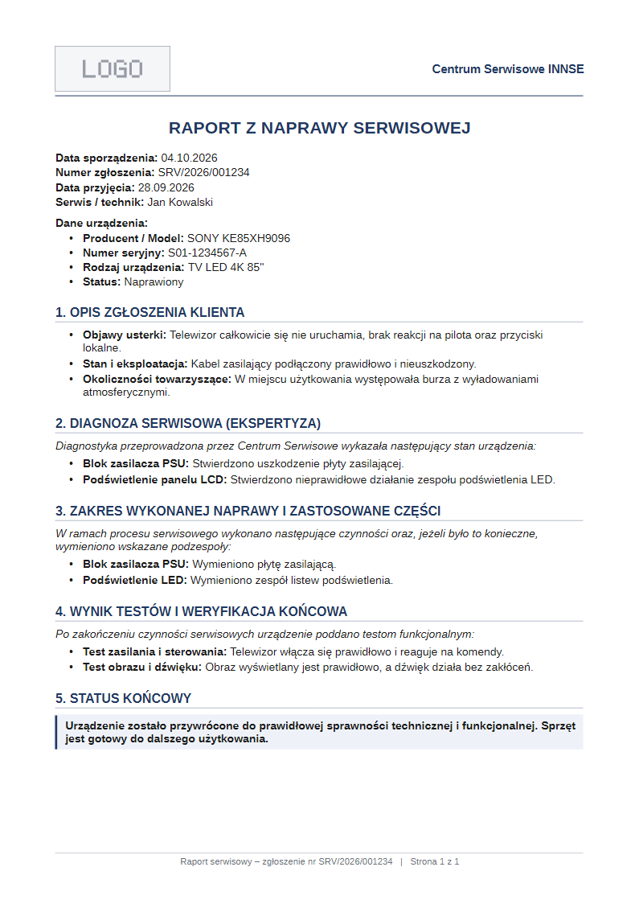
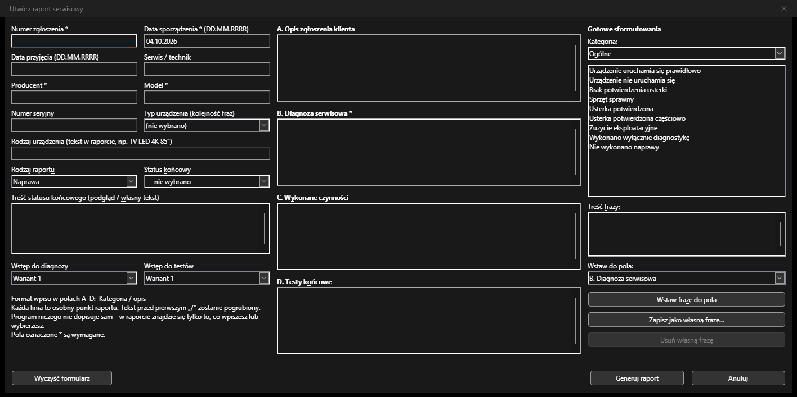

<div align="center">

# 🛠️ Raporty serwisowe INNSE

**Generator profesjonalnych raportów serwisowych dla LibreOffice Writer**

Formularz → gotowe sformułowania → raport w Writerze → ODT + PDF jednym kliknięciem.
Działa lokalnie i offline. Bez AI, bez chmury, bez zewnętrznych API.

[](https://github.com/Zwidek12/Raporty_serwisowe_Innse/releases/latest)




</div>

---

## ⚡ Szybki start

> **Wystarczy jeden plik: `ServiceReport.oxt`.**

1. Zainstaluj **LibreOffice 7.0 lub nowszy**: [libreoffice.org/download](https://www.libreoffice.org/download/download-libreoffice/)
2. Pobierz **[ServiceReport.oxt](https://github.com/Zwidek12/Raporty_serwisowe_Innse/releases/latest)** z zakładki *Releases*.
3. Kliknij plik dwukrotnie. LibreOffice otworzy Menedżer rozszerzeń, a Ty potwierdzasz instalację.
4. Uruchom ponownie LibreOffice i otwórz **Writer**. Pojawią się menu **Raport serwisowy** i przycisk **Utwórz raport serwisowy**.

<details>
<summary>Inne sposoby instalacji</summary>

- **Z menu:** *Narzędzia → Menedżer rozszerzeń → Dodaj…* → wskaż `ServiceReport.oxt`.
- **Skryptem (Windows):** sklonuj repozytorium, zamknij LibreOffice i uruchom `install.bat`.
  `install.bat /u` odinstalowuje rozszerzenie.
- **Dla wszystkich użytkowników komputera** (jako administrator):
  `unopkg add --shared --suppress-license ServiceReport.oxt`

Szczegóły: [docs/INSTALL.md](docs/INSTALL.md)
</details>

## 📋 Wymagania

| | Wymaganie |
|---|---|
| **Program** | LibreOffice **7.0+** (sprawdzone na 26.8, Windows 11) |
| **System** | Windows, Linux lub macOS |
| **Python** | wbudowany w LibreOffice na Windows i macOS. Na Linuksie zainstaluj `libreoffice-script-provider-python` (Debian/Ubuntu) lub `libreoffice-pyuno` (Fedora) |
| **Internet** | niepotrzebny |
| **Dodatkowe biblioteki** | brak |

## ✨ Funkcje

- **Formularz** z danymi zgłoszenia i urządzenia, rodzajem raportu i statusem końcowym.
- **Biblioteka gotowych sformułowań** w 15 kategoriach (zasilanie, bateria, wyświetlacz, zalanie, AGD, odkurzacze, testy, gwarancja…).
  Kategorie pasujące do wybranego typu urządzenia są na górze listy.
- **Własne frazy** zapisywane lokalnie w profilu użytkownika.
- **Automatyczny układ:** numerowane sekcje, punkty z pogrubioną etykietą, puste sekcje pomijane, poprawna paginacja długich raportów.
- **Podgląd przed zapisem:** raport otwiera się w Writerze do ręcznej korekty.
- **Zapis ODT + eksport PDF** (`Raport_<numer>.odt/.pdf`) z obsługą wersji (`_v2`, `_v3`…).
- **Walidacja:** wymagane pola oraz ostrzeżenia o niespójnościach, np. status „Naprawiony” bez wykonanych czynności.
- **Ustawienia:** logo, nazwa serwisu, katalog zapisu, domyślny technik, ODT i/lub PDF.

## 🔒 Zasada: zero wymyślonych faktów

Program **formatuje i porządkuje**, ale **niczego nie diagnozuje**.
W raporcie jest wyłącznie to, co operator wpisał albo świadomie wybrał.
Nie powstają zdania typu „zalanie spowodowało uszkodzenie” ani „producent wymieni urządzenie”.
Pilnują tego testy automatyczne.

## 📝 Jak używać



1. **Raport serwisowy → Nowy raport…** (lub przycisk na pasku narzędzi).
2. Uzupełnij dane i pola **A–D**. Każda linia to jeden punkt, w formacie:

   ```
   Kategoria / opis
   ```

   `Test USB / Sprawdzono ładowanie/komunikację z komputerem.`
   w raporcie wygląda tak: • **Test USB:** Sprawdzono ładowanie/komunikację z komputerem.

3. Dodawaj frazy z panelu **Gotowe sformułowania** (przycisk lub dwuklik).
4. **Generuj raport**, a potem przejrzyj i ewentualnie popraw dokument.
5. **Raport serwisowy → Zapisz i eksportuj PDF**.

Pełna instrukcja: [docs/USER_GUIDE.md](docs/USER_GUIDE.md)

## 🧑‍💻 Dla programistów

```
report_generator/   logika: parser, walidacja, model raportu, dokument, PDF, okna
extension/          pliki pakietu .oxt (komponent UNO, menu, pasek narzędzi)
resources/          szablon .ott, biblioteka fraz (JSON), logo zastępcze
tools/              budowanie szablonu i .oxt, weryfikacja w trybie headless
tests/              testy jednostkowe
```

```bash
LOPY="C:\Program Files\LibreOffice\program\python.exe"
"$LOPY" tools/build_template.py          # szablon resources/report_template.ott
"$LOPY" -m unittest discover -s tests    # testy
"$LOPY" tools/verify_generation.py       # przykładowe raporty ODT+PDF
python tools/build_oxt.py                # dist/ServiceReport.oxt
```

Frazy dodasz bez zmiany kodu, edytując `resources/phrases_default.json`.
Więcej: [docs/DEVELOPMENT.md](docs/DEVELOPMENT.md)
